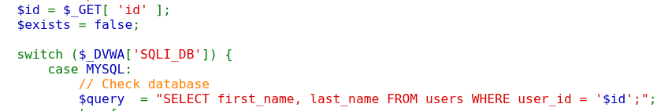
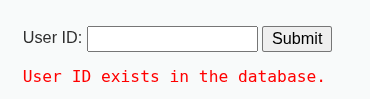
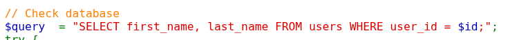
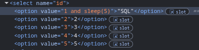
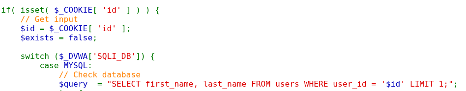
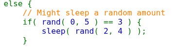
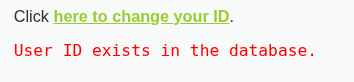

                                                  Blind SQL Injection

Security level: LOW 

Low darajasi tahlil qilinganda Boolean-Based Blind SQL Injection zaifligini aniqlandi.
Foydalanuvchi tomonidan kiritilgan id  parametri hech qanday tekshiruv va filtrlashsiz SQL so'roviga qo'shiladi.

Kodning zaif qismi:

Bunda $id qiymati to'g'ridan-to'g'ri SQL so'roviga qo'shilgani sababli SQL Injection zaifligi ishlaydi. 
So'rov bajarilgandan so'ng natija quyidagicha tekshiriladi:

    $exists = (mysqli_num_rows($result) > 0);

Agar kamida bitta qism qaytsa: User ID exists in the database.
Qaytmasa: User ID is missing from the database.
Foydalanuvchiga ma'lumotlar chiqarilmaydi, faqat True yoki False natijasi qaytariladi.

    - Exploit:
Pyload yuborildi :

    1' AND database()='dvwa'#

database()='dvwa' to'g'ri bo'lgani va user_id='1' mavjud bo'lgani uchun so'rov kamida bitta satr qaytardi.

Security level: Medium

SQL Injection'dan himoyalanish uchun mysqli_real_escape_string() funksiyasidan foydalanilgan.
$id SQL so'roviga qo'shtirnoqsiz qo'shilgan.

Medium darajasida foydalanuvchi id qiymatini text input orqali emas, HTML <select> orqali tanlaydi. Brauzer foydalanuvchiga faqat 1 dan 5 gacha bo'lgan qiymatlarni tanlashga ruxsat beradi.

Lekin brauzerning Devtool yoki Burp Suite yordamida <option>  qiymatini o'zgartirish mumkin.

1-indeks o'zgartirib ko'rildi.

    <option value="1 AND sleep(5)">SQL</option>

Sleep(5) ishladi va Time-Based Blind SQL injection borligi aniqlandi.

Security level: High

High xavfsizlik darajasini tahlil qilindi va Cookie orqali yuborilgan malumot yordamida Boolean-Based Blind SQL Injection zaifligini aniqlandi.

Foydalanuvchi kiritgan id qiymati GET yoki POST orqali emas, Cookie orqali olinadi.
Kodning asosiy qismi:

id qiymati hech qanday tekshiruv va filtrlashsiz SQL so'roviga qo'shilmoqda. Natijada foydalanuvchi Cookie qiymatini o'zgartirish orqali SQL buyruqlarini bajarishi mumkin.

Foydalanuvchi tomonidan yuborilgan Cookie tekshirilmaydi.

    $id = $_COOKIE['id'];

Kodning quyidagi qismi noto'g'ri natija qaytganda tasodifiy 2-4 soniya kutadi.

    - Exploit:

Payload 1' AND 1=1# yuborib ko'rildi. 
1=1 sharti doimo TRUE bo'lganligi sababli so'rov muvaffaqiyatli bajarildi va sahifada quyidagi javob qaytdi.

