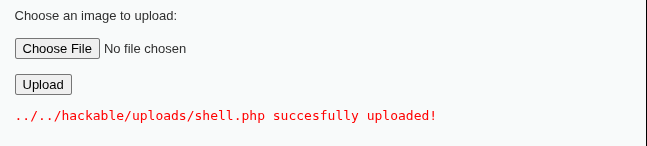
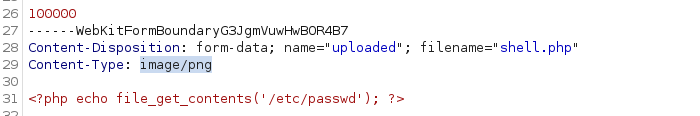
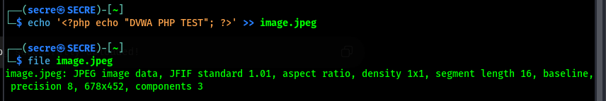
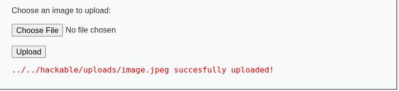

# Security Level: LOW

Low level source kodida yuklanayotgan fayl uchun extension, fayl mazmuni tekshirilmaydi.
```
$target_path = DVWA_WEB_PAGE_TO_ROOT . "hackable/uploads/"; $target_path .= basename( $_FILES[ 'uploaded' ][ 'name' ] );
Fayl esa to'g'ridan-to'g'ri serverga ko'chiriladi:
move_uploaded_file(
        $_FILES[ 'uploaded' ][ 'tmp_name' ],
        $target_path
);
```

Exploit:
Test uchun shell.php file yaratildi uning ichida `<?php echo "DVWA PHP TEST"; ?>` payload yozildi.

Natija:



# Security Level: Medium

Server faylning Content-Type va hajmini tekshiradi:
```
    // File information
    $uploaded_name = $_FILES[ 'uploaded' ][ 'name' ];
    $uploaded_type = $_FILES[ 'uploaded' ][ 'type' ];
    $uploaded_size = $_FILES[ 'uploaded' ][ 'size' ];

    // Is it an image?
    if( ( $uploaded_type == "image/jpeg" || $uploaded_type == "image/png" ) &&
        ( $uploaded_size < 100000 ) ) {
```
Lekin faylning haqiqiy mazmuni tekshirilmaydi. `Content-Type` qiymati client tomonidan yuborilgani sababli uni o'zgartirish mumkin.

Exploit:
choose file orqali `shell.php` tanlanib upload bosilganda Burp Suite orqali so'rov ushlandi, so'rovda `Content-Type: application/x-php` qiymati `image/png` ga o'zgartirildi. So'rov Forward qilindi



Natija:


# Security Level: High

High levelda extension, fayl hajmi va rasm formatini tekshirish mavjud:
```
    // File information
    $uploaded_name = $_FILES[ 'uploaded' ][ 'name' ];
    $uploaded_ext  = substr( $uploaded_name, strrpos( $uploaded_name, '.' ) + 1);
    $uploaded_size = $_FILES[ 'uploaded' ][ 'size' ];
    $uploaded_tmp  = $_FILES[ 'uploaded' ][ 'tmp_name' ];

    // Is it an image?
    if( ( strtolower( $uploaded_ext ) == "jpg" || strtolower( $uploaded_ext ) == "jpeg" || strtolower( $uploaded_ext ) == "png" ) &&
        ( $uploaded_size < 100000 ) &&
        getimagesize( $uploaded_tmp ) ) {
```
`getimagesize()` faylning rasm ekanligini tekshirdi, lekin rasm faylining ichiga qo'shimcha PHP kod joylashtirilganini tekshirmadi.
Haqiqiy JPEG faylning oxiriga quyidagi PHP kod qo'shildi:



Fayl .jpeg formatda saqlandi va upload qilindi.




