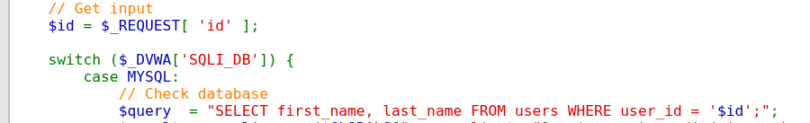
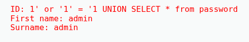
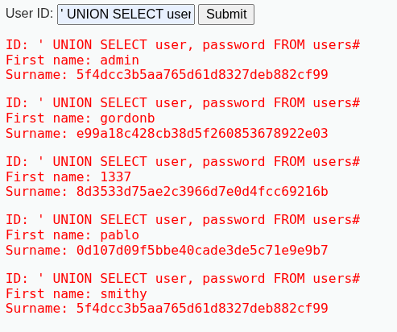
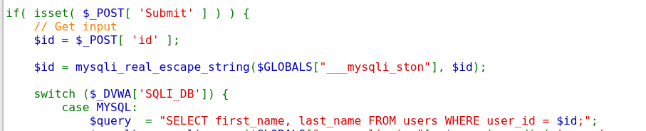
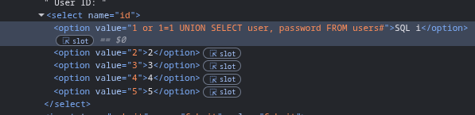
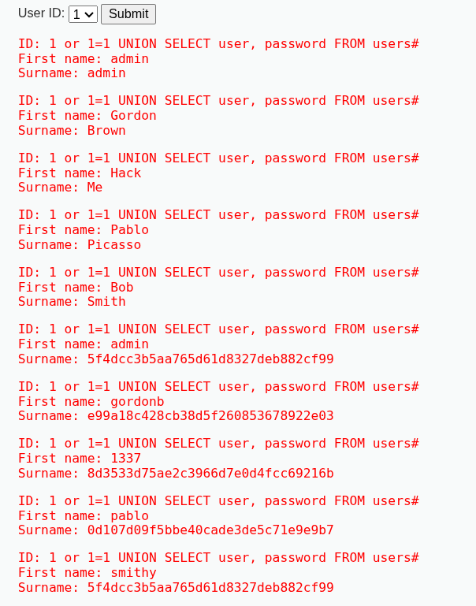
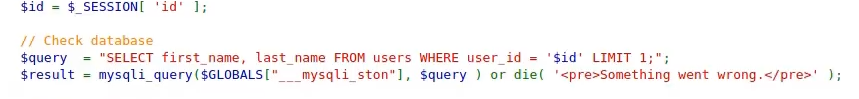
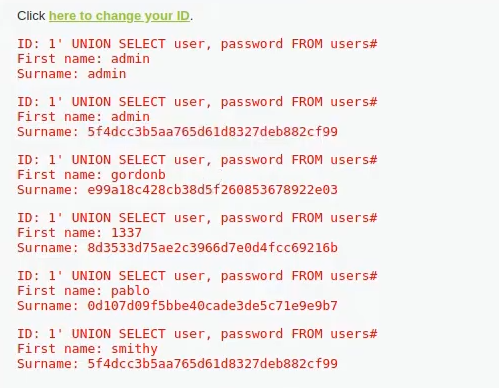
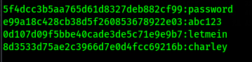

# SQL Injection

## Security level: LOW

Bu laboratoriyada foydalanuvchi kiritadigan `id` parametri hech qanday tekshiruvlarsiz SQL so'rovlariga qo'shiladi.

Kodning zaif qismi:



Bu yerda `id` to'g'ridan-to'g'ri SQL ga qo'shildi.

**Exploit:**

SQL injection mavjudligini tekshirish uchun `id` parametriga SQL kodi yuborildi:

```
1' or '1' = '1
```



```
' UNION SELECT user, password FROM users#
```



Natijada SQL buyruqlari yordamida bir nechta ma'lumotlar qaytarildi.

## Security level: Medium

Mediumda SQL Injection xavfini kamaytirish uchun foydalanuvchi ma'lumotini POST orqali qabul qiladi hamda `mysql_real_escape_string()` funksiyasidan foydalanadi. Biroq foydalanuvchi qiymati hali ham SQL so'roviga qo'shiladi.

Source code:



`mysql_real_escape_string()` funksiyasi qo'shilgan bo'lsa-da, foydalanuvchi kiritgan qiymat SQL so'roviga to'g'ridan-to'g'ri qo'shildi.

**Exploit:**

Brauzerning Devtool yordamida `id` qiymati SQL so'roviga o'zgartirildi:

```
1 or 1=1 UNION SELECT user, password FROM users#
```



Natijada `users` jadvalidagi foydalanuvchi nomlari va parol xeshlari sahifada chiqarildi.



## Security level: High

High darajada so'rovlar GET yoki POST orqali olinmaydi, qiymat server tomonidagi `$_SESSION` orqali SQL so'roviga uzatiladi. Bundan tashqari SQL xatolari foydalanuvchiga ko'rsatilmaydi va `LIMIT 1` operatoridan foydalanilgan.

Lekin foydalanuvchi yuborgan SQL so'rovi hech qanday tekshiruvlarsiz qo'shilganligi sababli, zaiflik yo'qolmagan.

Source code:



**Exploit:**

"Change your ID" qismiga SQL so'rovi yuborib ko'rildi:

```
' UNION SELECT user, password FROM users#
```



`UNION SELECT` yordamida `users` jadvalidagi `user` va `password` ustunlari chiqdi.

Aniqlangan hash qiymatlari Hashcat yordamida topildi.


